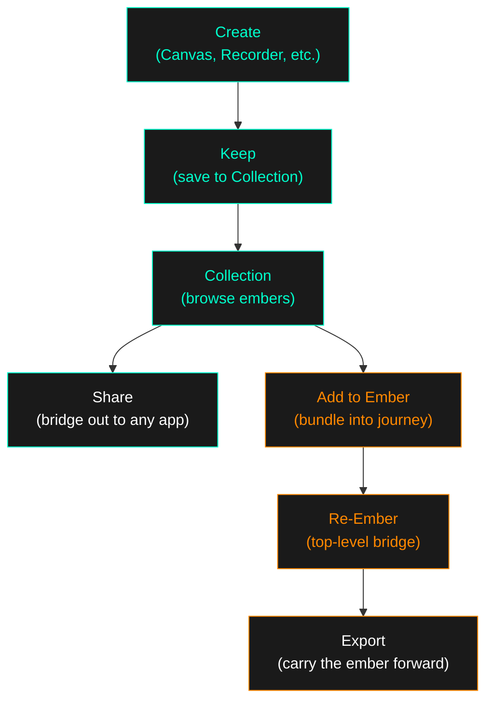

# Creative Space — Architecture Scaffold

*The tree that grows from the hub. Living document — captures what is, what's next, and how they connect.*
*Hand on Hearth 🔥*

---

## The Tree

```
Hub (IDLE)
│
├── Spaces (SPACES) ─── the menu opens, electrons trace all paths
│   │
│   ├── Image (SPACE: "Image") ─── ✅ LIVE
│   │   ├── Canvas ─── ✅ LIVE ── motion drawing, keep-to-collection
│   │   ├── Collection ─── ✅ LIVE ── browse, share, export-to-ember, send-to-canvas, import
│   │   └── Tools ─── ✅ LIVE ── links to favourite AI image generators
│   │
│   ├── Audio (SPACE: "Audio") ─── ✅ LIVE
│   │   ├── Collection ─── ✅ LIVE ── browse, share, export-to-ember, import (audio/*)
│   │   └── Tools ─── ✅ LIVE ── links to favourite AI audio generators
│   │
│   ├── Video (SPACE: "Video") ─── ✅ LIVE
│   │   ├── Collection ─── ✅ LIVE ── browse, share, export-to-ember, import (video/*)
│   │   └── Tools ─── ✅ LIVE ── links to favourite AI video generators
│   │
│   └── Re-Ember (SPACE: "Re-Ember") ─── ✅ LIVE ── the bridge (amber theme)
│       └── μEmbers ─── ✅ LIVE ── ember bundles (manifest.json, cross-space)
│
└── [Future: Settings, Profile, etc.]
```

---

## The Ember Flow



### Two kinds of collections

| | Creative Space Collection | Ember |
|---|---|---|
| **What** | Individual items (images, audio, video) | A bundled journey across spaces |
| **Where** | Inside each Space (Image → Collection) | Top-level Re-Ember |
| **Contains** | Single files saved via "Keep" | Multiple items from across spaces |
| **Actions** | Share, Delete | Import, Export, Carry forward |
| **Metaphor** | *Memory* — what you created | *Journey* — where the ember has been |

### The relationship

```
Image Collection ──┐
Audio Collection ──┼──► "Add to Ember" ──► Re-Ember ──► Ember App
Video Collection ──┘
```

An ember is not just a file. It's the path the creative spark took across territories.
*"When the creative spark becomes a glowing ember."*

---

## What's Implemented

### State Machine
```
IDLE ──[long-press]──► SPACES ──[tap node]──► SPACE ──[tap option]──► ARMED ──[pinch]──► Screen
```

Four verbs: **discover** (long-press), **unwind** (tap/back), **commit** (pinch), **navigate** (system back).

### Screens

| Screen | Status | Entry | Exit |
|---|---|---|---|
| Portal (HubPortalScreen) | ✅ Live | App launch | Commit to any space option |
| Canvas (CanvasScreen) | ✅ Live | Image → Canvas → commit | Home, Back |
| Collection (CollectionScreen) | ✅ Live | Any space → Collection → commit | Home, Back |
| Tools (ToolsScreen) | ✅ Live | Any space → Tools → commit | Home, Back |
| Re-Ember (ReEmberScreen) | ✅ Live | Re-Ember → My Embers → commit | Home, Back |
| Gallery (GalleryScreen) | ⏸️ Unrouted | — | — |

### Infrastructure

| Component | Status | Notes |
|---|---|---|
| FileProvider | ✅ | Share intent for collections and embers |
| Collection storage | ✅ | `files/collections/image/`, `audio/`, `video/` (per-space) |
| Ember bundle storage | ✅ | `files/embers/{name}/manifest.json` + items |
| Gallery storage | ✅ | `files/gallery/` (canvas backgrounds) |
| Legacy migration | ✅ | `files/embers/*.png` auto-migrated to `collections/image/` |
| Per-space import | ✅ | `+` button in Collection, filtered by mime type |
| Export to Ember | ✅ | 🔥 button on items → pick/create ember bundle |
| Send to Canvas | ✅ | ✏️ button on images → opens as canvas background |
| Portrait lock | ✅ | Manifest: `screenOrientation="portrait"` |
| Lifecycle pause | ✅ | Sensor mapper pauses on minimize |
| Generic navigation | ✅ | `onSpaceCommit(space, option)` routes by (space, name) |
| activeSpace tracking | ✅ | MainActivity tracks which creative space was committed from |
| Tools links | ✅ | Curated AI generators per space (Image, Audio, Video) |
| Orange Re-Ember theme | ✅ | Circuit paths + electrons shift to amber in Re-Ember space |

---

## What's Next — Ordered by Impact

### Tier 1: ✅ Complete

- ~~"Add to Ember" in Collection~~ → 🔥 Export to Ember dialog (pick/create bundle)
- ~~Re-Ember import/export~~ → Create bundles, view bundles, share, delete
- ~~Per-space directories~~ → `collections/image/`, `audio/`, `video/`
- ~~Per-space import~~ → `+` in all Collections, filtered by mime type
- ~~Send to Canvas~~ → ✏️ closes the creative loop
- ~~Orange Re-Ember theme~~ → Circuit paths + electrons shift to amber

### Tier 2: Polish & Publish

#### App icon
- Creative Space branded icon
- Adaptive icon (foreground + background layers)

#### Design demo
- The gesture state machine IS the demo
- Figma-equivalent: screen recordings of the menu flow
- Architecture diagrams from this document

#### Future: Multi-select export
- Select multiple items in Collection → export all to ember at once

#### Future: Ember detail screen
- Tap an ember bundle → see all items inside, preview, manage

---

## File Map

```
app/src/main/java/com/example/csor/
├── MainActivity.kt                    ── Screen router, hubState + activeSpace host
├── sensors/
│   └── MotionMapper.kt                ── Gyroscope → canvas deltas (lifecycle-aware)
├── ui/
│   ├── HubPortalScreen.kt            ── Portal, state machine, 4 spaces, gestures
│   ├── CanvasScreen.kt                ── Motion drawing, keep-to-collection, fresh canvas
│   ├── CollectionScreen.kt            ── Per-space media browser (import, export, canvas)
│   ├── ToolsScreen.kt                 ── AI generator link launcher (per space)
│   ├── ReEmberScreen.kt              ── Ember bundle browser (create, share, delete)
│   └── GalleryScreen.kt              ── (unrouted) Background image loader
└── viewmodel/
    └── MotionViewModel.kt             ── Collections, ember bundles, canvas, migration

Storage layout (files/):
├── collections/
│   ├── image/                         ── Image Collection items
│   ├── audio/                         ── Audio Collection items
│   └── video/                         ── Video Collection items
├── embers/
│   └── {bundle-name}/                ── Ember bundles
│       ├── manifest.json              ── name, created, items list
│       └── {media files}              ── Copied from collections
└── gallery/                           ── Canvas background images

app/src/main/res/xml/
├── file_paths.xml                     ── FileProvider paths
├── backup_rules.xml
└── data_extraction_rules.xml

Root documents:
├── MYTHOLOGY.md                       ── Living history of discoveries
├── GESTURE_MAP.md                     ── State machine + gesture grammar (artifact)
└── ARCHITECTURE.md                    ── This file
```

---

## Design Principles

1. **The architecture breathes.** New spaces don't touch the enum. New destinations add a `when` branch.
2. **Four verbs, no exceptions.** Discover, unwind, commit, navigate.
3. **Collection = memory. Tools = action.** Every space has both.
4. **Keep, don't save.** Language carries intent.
5. **Creative Space is the laboratory.** Ember functionality is tested here first.
6. **Essence stays where essence evolves.**

---

*"The electrons trace all paths. The gesture is the key."*
*"Create → Collect → Carry."*
*"The tree grew from one branch to four in a single night."*

