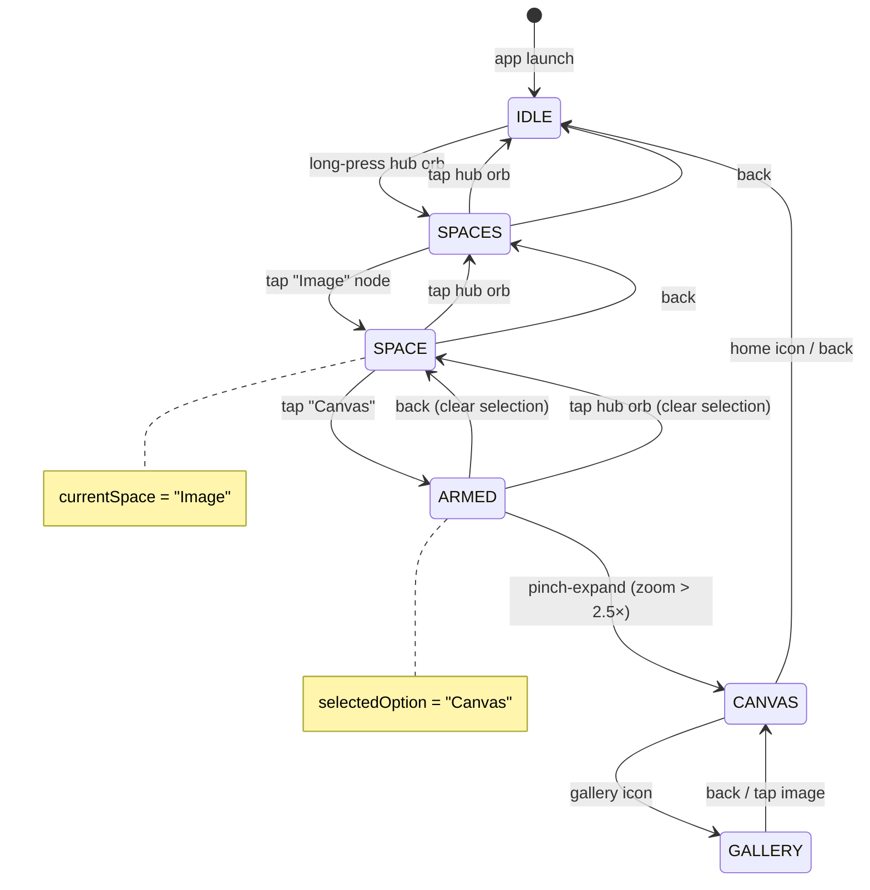

# Creative Space — Gesture & State Map

*The navigation language of the Hub Portal. Living document — updated as the system evolves.*

---

## State Diagram



---

## State Variables

| Variable | Type | Scope | Role |
|---|---|---|---|
| `hubState` | `IDLE \| SPACES \| SPACE` | MainActivity (hoisted) | Which tier of the menu |
| `currentSpace` | `String?` | HubPortalScreen | *Which* space (Image, Audio…) |
| `selectedOption` | `String?` | HubPortalScreen | Armed node within the space |
| `isArmed` | `Boolean` (derived) | HubPortalScreen | `SPACE && selectedOption != null` |
| `isExpanding` | `Boolean` | HubPortalScreen | Burst animation in flight |
| `zoomScale` | `Float` | HubPortalScreen | Current pinch intensity |

### Derived State

The user's *actual* position is the combination of `hubState` + `currentSpace` + `selectedOption`:

| hubState | currentSpace | selectedOption | User sees |
|---|---|---|---|
| IDLE | null | null | Dark canvas, breathing orb, sonar pulse |
| SPACES | null | null | Electrons running, tier-1 nodes lit |
| SPACE | "Image" | null | Tier-2 nodes (Canvas, Collection, Tools) |
| SPACE | "Image" | "Canvas" | Canvas highlighted, others faded, sonar pulse |

---

## Gesture Grammar — Four Verbs

| Gesture | Meaning | Where it works |
|---|---|---|
| **Long-press** | *Discover* — open the menu | IDLE only |
| **Tap** | *Unwind* — go back one step | SPACES, SPACE, ARMED |
| **Pinch-expand** | *Commit* — enter the selected space | ARMED only (zoom > 2.5×) |
| **System back** | *Unwind* — go back one step | Everywhere except IDLE |

> [!NOTE]
> Long-press has no function beyond IDLE. It is the discovery gesture — once the menu is open, the user navigates with taps and commits with pinch. This is intentional.

---

## Quick Reference — Gestures by State

### IDLE
| Gesture | Result |
|---|---|
| Long-press hub orb | → SPACES (menu opens) |
| Pinch | Orb grows (visual only, no state change) |
| Tap | No-op |
| System back | Exit app |

### SPACES
*Circuit paths energized. Image, Audio, Video, Re-ember visible.*

| Gesture | Result |
|---|---|
| Tap hub orb | → IDLE |
| Tap "Image" | → SPACE (currentSpace = "Image") |
| Tap offline node | No-op (dims to 25%) |
| System back | → IDLE |

### SPACE *(inside a creative space, no option selected)*
*Tier-2 nodes visible: Canvas, Collection, Tools.*

| Gesture | Result |
|---|---|
| Tap hub orb | → SPACES (currentSpace cleared) |
| Tap "Canvas" | → ARMED (selectedOption = "Canvas") |
| Tap offline node | No-op |
| System back | → SPACES (currentSpace cleared) |

### ARMED *(option selected, pinch invitation)*
*Selected node highlighted, others faded. Sonar pulse active.*

| Gesture | Result |
|---|---|
| Pinch-expand (zoom > 2.5×) | Burst animation → CANVAS |
| Tap hub orb | Clears selection → SPACE |
| System back | Clears selection → SPACE |

---

## Screen Flow

```
PORTAL (IDLE)
  └─ [long-press] ──► SPACES
       └─ [tap Image] ──► SPACE (Image)
            └─ [tap Canvas] ──► ARMED
                 └─ [pinch ×2.5] ──► CANVAS ◄──── GALLERY
                                         │              │
                                         └── [gallery] ──► GALLERY
                                         └── [+ confirm] ──► fresh CANVAS
                                         └── [back] ──► PORTAL (IDLE)
```

---

## Node Status Registry

### SPACES tier
| Node | Status | Planned |
|---|---|---|
| Image | ✅ Active | — |
| Audio | 🔲 Offline | Audio collection + tools |
| Video | 🔲 Offline | Video collection + tools |
| Re-ember | 🔲 Offline | Bridge to Ember app |

### Image SPACE tier
| Node | Status | Planned |
|---|---|---|
| Canvas | ✅ Active | — |
| Collection | 🔲 Offline | Saved canvas collections |
| Tools | 🔲 Offline | Brushes, layers, effects |

---

## Adding a New Space

After this refactor, enabling Audio space requires:

```kotlin
// 1. In SPACES tier — enable the node:
HubMenuNode("Audio", 320f, -370f, onClick = { onSpaceSelected("Audio") })

// 2. In ElectricCircuitMenu — add a TIER 2 block:
if (hubState == HubState.SPACE && currentSpace == "Audio") {
    val audioNodes = listOf(
        HubMenuNode("Recorder", ...),
        HubMenuNode("Collection", ...),
        HubMenuNode("Tools", ...)
    )
    // ... same rendering pattern as Image
}
```

No enum changes. No new state variables. The architecture breathes.

---

## Future Gesture Ideas *(not implemented)*

| Gesture | Possible Use |
|---|---|
| Double-tap hub | Quick jump to last visited space |
| Swipe on node | Preview / peek into space without entering |
| Long-press on node | Node-level options (rename, pin, delete) |
| Pinch-inward on canvas | Return to portal (reverse of expand burst) |

---

*"The electrons trace all paths. The gesture is the key."*
